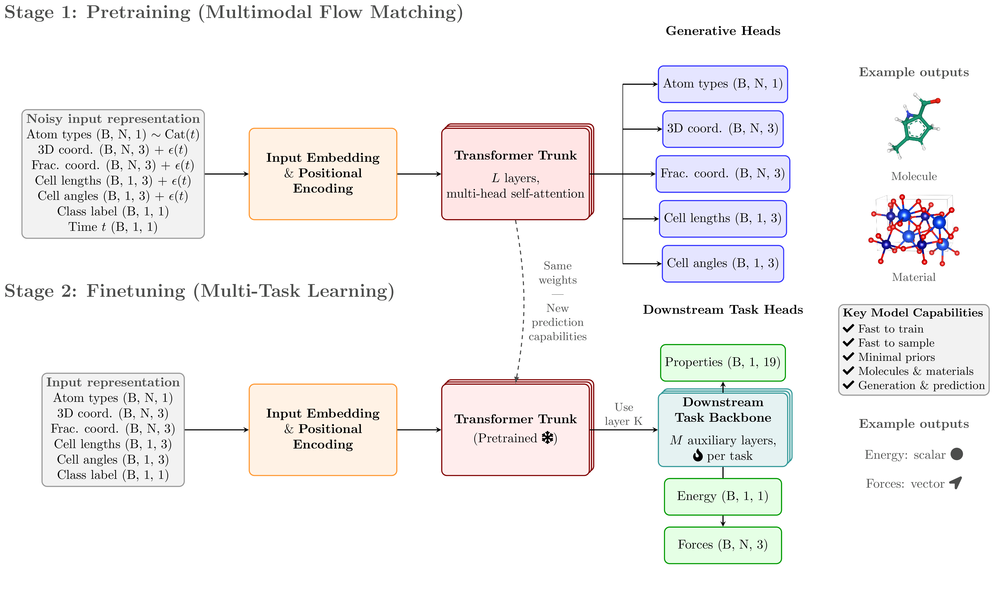

<div align="center">

# Zatom

<a href="https://pytorch.org/get-started/locally/"></a>
<a href="https://pytorchlightning.ai/"></a>
<a href="https://hydra.cc/"></a>

<!-- <a href="https://github.com/ashleve/lightning-hydra-template"></a><br> -->

<!-- [](https://www.nature.com/articles/nature14539) -->

<!-- [](https://papers.nips.cc/paper/2020) -->



</div>

## Description

Official repository of Zatom, a unified 3D molecule and material foundation model

## Installation

> 💡 Note: Make sure to create a `.env` file, for which you can reference `.env.example` as an example.

### Default

> 💡 Note: We recommend installing `zatom` in a clean Python environment, using `conda` or otherwise.

For example, to install `conda`, one can use the following commands.

```bash
wget "https://github.com/conda-forge/miniforge/releases/download/25.3.1-0/Miniforge3-$(uname)-$(uname -m).sh"
bash Miniforge3-$(uname)-$(uname -m).sh  # accept all terms and install to the default location
rm Miniforge3-$(uname)-$(uname -m).sh  # (optionally) remove installer after using it
source ~/.bashrc  # or `source ~/.zshrc` - alternatively, one can restart their shell session to achieve the same result
```

With `conda` available, one can build a virtual environment for `zatom`.

```bash
# Clone project, making sure Git LFS is installed beforehand (https://git-lfs.com/)
git clone https://github.com/amorehead/zatom
cd zatom

# [OPTIONAL] Create Conda environment (for Linux)
conda create -n zatom -c conda-forge python=3.10 gcc=11.4.0 gxx=11.4.0 libstdcxx=14.1.0 libstdcxx-ng=14.1.0 libgcc=14.1.0 libgcc-ng=14.1.0 compilers=1.5.2
conda activate zatom

# [OPTIONAL] Alternatively, create Conda environment (for macOS)
conda create -n zatom -c conda-forge python=3.10 clang=18 clangxx=18 libcxx=18 libcxx-devel=18 libgfortran5=15.1.0 lld=20.1.7 pybind11=3.0.0
conda activate zatom

# [OPTIONAL] Install `pyeqeq` (for macOS)
export CC=clang
export CXX=clang++
export CPPFLAGS="-isystem $CONDA_PREFIX/include -isystem $CONDA_PREFIX/include/c++/v1"
export CXXFLAGS="-std=c++17"
export LDFLAGS="-fuse-ld=lld -L$CONDA_PREFIX/lib"
export DYLD_LIBRARY_PATH="$CONDA_PREFIX/lib:$DYLD_LIBRARY_PATH"
pip install --no-build-isolation pyeqeq
unset DYLD_LIBRARY_PATH

# Install requirements
pip install -e '.[cuda]'

# [OPTIONAL] Install pre-commit hooks
pre-commit install
```

> 💡 Note: If you are installing on systems without access to CUDA GPUs (namely macOS or ROCm systems), remove `[cuda]` from the above commands. Be aware that the CPU-only version (e.g., without macOS's MPS GPU backend) will be significantly slower than the GPU version.

> If run into GLIBC incompatibility issues on SLURM, most likely caused by `torch-scatter`, we recommend the following:
>
> ```bash
> $ module avail gcc
> $ module load GCC/12.2.0
> $ conda uninstall torch-scatter
> $ pip uninstall torch-scatter
> $ pip install torch-scatter --no-binary torch-scatter --no-cache-dir --no-build-isolation
> ```
>
> This installs the source tarball and compiles it locally, linking against your cluster's GLIBC.

### `uv`

You can also set up the environment via `uv`. You can find installation instructions [here](https://docs.astral.sh/uv/).

```
uv venv
source .venv/bin/activate
uv pip install -e .
```

> 💡 Note: To install `zatom` with `uv` on a Windows or macOS-based system, remove the `torch-scatter` installation links in `pyproject.toml` for these platforms before running `uv pip install -e .`.

### Docker

For sake of reproducibility, one can alternatively build a (CUDA-based) Docker image for `zatom`.

```bash
# Clone project, making sure Git LFS is installed beforehand (https://git-lfs.com/)
git clone https://github.com/amorehead/zatom
cd zatom

# Enable BuildKit to securely pass GitHub access token to Docker
export DOCKER_BUILDKIT=1
export GITHUB_TOKEN=your_token_value

# E.g., to build image on local machine
docker build --platform linux/amd64 --secret id=github_token,env=GITHUB_TOKEN --no-cache -t zatom:0.0.1 - < Dockerfile
# Skip the following three steps if not using NERSC cluster
docker login registry.nersc.gov
docker tag zatom:0.0.1 registry.nersc.gov/dasrepo/acmwhb/zatom:0.0.1
docker push registry.nersc.gov/dasrepo/acmwhb/zatom:0.0.1

# E.g., alternatively, to build image on NERSC cluster
podman-hpc build --platform linux/amd64 --secret id=github_token,env=GITHUB_TOKEN --no-cache -t zatom:0.0.1 - < Dockerfile
podman-hpc migrate zatom:0.0.1
podman-hpc login registry.nersc.gov
podman-hpc tag zatom:0.0.1 registry.nersc.gov/dasrepo/acmwhb/zatom:0.0.1
podman-hpc push registry.nersc.gov/dasrepo/acmwhb/zatom:0.0.1

# If using NERSC cluster, prepare image with Shifter
shifterimg login registry.nersc.gov
shifterimg -v pull registry.nersc.gov/dasrepo/acmwhb/zatom:0.0.1
```

> 💡 Note: The Docker image is ~30 GB in size. Make sure you have enough storage space beforehand to build it.

## Training

Train model with default configuration

> 💡 Note: The first time (only) you run the code, you'll need to uncomment Line 75 (`datamodule.setup()`) of `zatom/train_fm.py` to download each dataset's metadata for subsequent training or evaluation runs.

```bash
# train on CPU
python zatom/train_fm.py trainer=cpu

# train on GPU
python zatom/train_fm.py trainer=gpu

# train on macOS
python zatom/train_fm.py trainer=mps
```

Train model with chosen experiment configuration from [configs/experiment/](configs/experiment/)

```bash
python zatom/train_fm.py experiment=experiment_name.yaml
```

For example, reproduce Zatom's default model (pre)training run

```bash
python zatom/train_fm.py experiment=train
```

**Note:** You can override any parameter from the command line like this

```bash
python zatom/train_fm.py trainer.max_epochs=2000 data.datamodule.batch_size.train=8
```

> 💡 Note: See the [VS Code](https://code.visualstudio.com/) runtime configs within `.vscode/launch.json` for full examples of how to locally customize or debug model training. The scripts within `scripts/perlmutter/` additionally describe how to train models on a SLURM cluster.

## Evaluation

To generate Zatom's initial evaluation metrics for molecule and material generation

```bash
python zatom/eval_fm.py ckpt_path=checkpoints/zatom_joint_paper_weights.ckpt trainer=gpu
```

To evaluate Zatom's molecule property predictions

```bash
python zatom/eval_fm.py ckpt_path=checkpoints/zatom_joint_paper_weights.ckpt data.datamodule.batch_size.train=128 data.datamodule.batch_size.val=128 data.datamodule.batch_size.test=128 data.datamodule.datasets.mp20.proportion=0.0 data.datamodule.datasets.qm9.proportion=1.0 data.datamodule.datasets.qm9.global_property=[mu,alpha,homo,lumo,gap,r2,zpve,U0,U,H,G,Cv,U0_atom,U_atom,H_atom,G_atom,A,B,C] model.architecture.num_aux_layers=4 model.sampling.num_samples=1 model.sampling.batch_size=1 seed=42 trainer=gpu
```

> 💡 Note: Consider using [`Protein Viewer`](https://marketplace.visualstudio.com/items?itemName=ArianJamasb.protein-viewer) for VS Code to visualize molecules and using [`VESTA`](https://jp-minerals.org/vesta/en/) locally to visualize materials. Running [`PyMOL`](https://www.pymol.org/) locally may also be useful for aligning/comparing two molecules.

> 💡 Note: If you want to compute energy above hull for materials, you must [download the convex hull from 2023-02-07](https://figshare.com/articles/dataset/Matbench_Discovery_v1_0_0/22715158?file=40344451). Extract the files to the directory `forks/flowmm/mp_02072023/` and then run `gunzip forks/flowmm/mp_02072023/2023-02-07-ppd-mp.pkl.gz`. We got this hull from [Matbench Discovery](https://matbench-discovery.materialsproject.org/).

> 💡 Note: Doing density functional theory (DFT) with [VASP](https://www.vasp.at/) requires a VASP license to define the required environment variable `PATH_TO_YOUR_PSEUDOPOTENTIALS`. We do not provide guidance on running DFT. That being said, your DFT results should typically be [corrected using the settings from the Materials Project](https://docs.materialsproject.org/methodology/materials-methodology/thermodynamic-stability/thermodynamic-stability).

To fully evaluate the generated materials

```bash
export PROJECT_ROOT=$(pwd)/forks/flowmm
export PMG_VASP_PSP_DIR=PATH_TO_YOUR_PSEUDOPOTENTIALS

# Change as needed
eval_dir="$(pwd)/logs/eval_fm/runs/eval_tft_80M_MP20_pbzagonf_2025-10-30_10-30-00"

eval_for_dft_samples="$eval_dir/mp20_test_0"
eval_for_dft_json="$eval_dir/mp20_test_0.json"
eval_log_dir="$eval_dir/chgnet_log_dir"

# Set other flags if you are using SLURM; if not using SLURM, do not pass `--slurm_partition`
num_jobs=1
slurm_partition=YOUR_SLURM_PARTITION

# Consolidate
eval_for_dft_pt=$(python forks/flowmm/scripts_model/evaluate.py consolidate $eval_for_dft_samples --subdir "mp20_test_0" --path_eval_pt eval_for_dft.pt | tail -n 1)

# Pre-relax
python forks/flowmm/scripts_analysis/prerelax.py "$eval_for_dft_pt" "$eval_for_dft_json" "$eval_log_dir" --num_jobs "$num_jobs" --slurm_partition "$slurm_partition"

# DFT
dft_dir="$eval_dir/dft"
mkdir -p "$dft_dir"
python forks/flowmm/scripts_analysis/dft_create_inputs.py "$eval_for_dft_json" "$dft_dir"

# Energy above hull
json_e_above_hull="$eval_dir/ehulls.json"
python forks/flowmm/scripts_analysis/ehull.py "$eval_for_dft_json" "$json_e_above_hull"

# Corrected energy above hull
root_dft_clean_outputs="$eval_dir"
ehulls_corrected_json="$eval_dir/ehulls_corrected.json"
python forks/flowmm/scripts_analysis/ehull_correction.py "$eval_for_dft_json" "$ehulls_corrected_json" --root_dft_clean_outputs "$root_dft_clean_outputs"

# S.U.N.
sun_json=sun.json
python forks/flowmm/scripts_analysis/novelty.py "$eval_for_dft_json" "$sun_json" --ehulls "$ehulls_corrected_json"
```

## For developers

Set up `pre-commit` (one time only) for automatic code linting and formatting upon each `git commit`

```bash
pre-commit install
```

Manually reformat all files in the project, as desired

```bash
pre-commit run -a
```

## Acknowledgements

`zatom` builds upon the source code and data from the following projects:

- [all-atom-diffusion-transformer](https://github.com/facebookresearch/all-atom-diffusion-transformer)
- [flow_matching](https://github.com/facebookresearch/flow_matching)
- [jvp_flash_attention](https://github.com/amorehead/jvp_flash_attention)
- [lightning-hydra-template](https://github.com/ashleve/lightning-hydra-template)
- [PlatonicTransformers](https://github.com/niazoys/PlatonicTransformers)
- [ProteinWorkshop](https://github.com/a-r-j/ProteinWorkshop)
- [posebusters](https://github.com/maabuu/posebusters)
- [tabasco](https://github.com/carlosinator/tabasco)

We thank all their contributors and maintainers!
